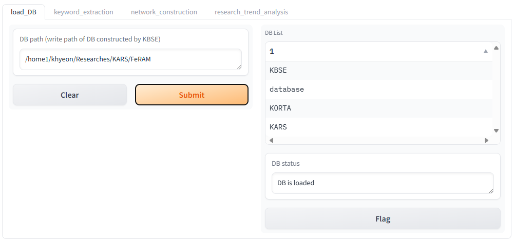
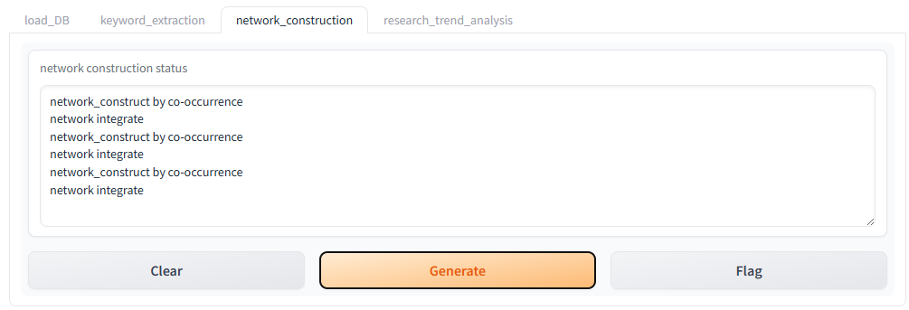
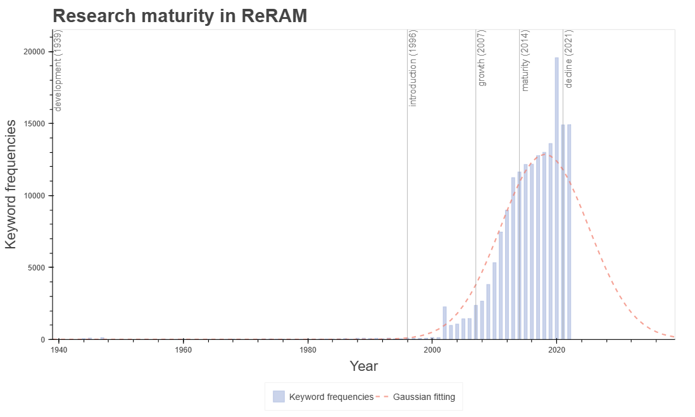

<p align="center"></p>

# Keyword-based Automatic Research Structurization (KARS)
A tool that automatically extracts keywords from scientific literature based on bibliographic metadata, structures the research field, and analyzes research trends. It presents spatial structures and temporal flows of research.

## Table of Contents
- [Features](#features)
- [Installation](#installation)
- [Quick Start](#quick-start)
- [Example Dataset: ReRAM Present and Future](#example-dataset-reram-present-and-future)
- [Results](#results)
- [Citations](#citations)
- [Contributors](#contributors)

## Features
- Automatic keyword extraction from bibliographic data
- Construction of modularized keyword networks (PageRank for importance, Louvain modularity for communities)
- Temporal trend analysis across years and communities
- Interactive HTML visualizations and Gephi export

## Installation
1. Clone the repository
```bash
git clone https://github.com/khyeon-cnmd/KARS.git
cd KARS
```

2. Create and activate a Conda environment (Python 3.10)
```bash
conda create -n KARS python==3.10
conda activate KARS
```

3. Install Python dependencies
```bash
pip install jsonlines gradio==3.47.0 "networkx[default]" tqdm pandas scipy bokeh spacy
```

4. Download spaCy models
```bash
python -m spacy download en_core_web_sm
python -m spacy download en_core_web_trf
```

## Quick Start
Run the GUI:
```bash
python KARS_GUI.py
```

### 1. DB construction
<p align="center"></p>

- Retrieve the bibliographic metadata using your preferred engines (e.g., Web of Science, Crossref)
- Make folder structure as below (refer to the image)
```
DB_name
└── 1
    └── KBSE.json
└── 2
    └── KBSE.json
└── ...
```
- Convert each metadata into the json format as in `KBSE.json` (see `example_metadata.json` for reference)
- Please refer to the example DB structure of 'ReRAM_DB.tar'

### 2. load_DB
<p align="center"></p>

- Enter the path to the database directory that contains bibliographic metadata, then click Submit to load.

### 3. keyword_extraction
<p align="center"></p>

- UPoS model:
  - `en_core_web_sm` — Faster, lighter.
  - `en_core_web_trf` — More accurate, slower.
- Text source:
  - `title` — Extract keywords from article titles.
  - `abstract` — Extract keywords from article abstracts.

### 4. network_construction
<p align="center"></p>

- Click Submit to build a keyword co-occurrence network across articles.

### 5. research_trend_analysis
<p align="center"></p>

- Keyword frequency cutoff (%) — Filter out infrequent keywords.
  - Higher → fewer, larger keywords; may miss relevant terms.
  - Lower → more, smaller keywords; includes rarer terms.
- Community min-frequency weight — Filter out less mature communities.
  - Higher → fewer communities.
  - Lower → more communities.
- Year range — Set minimum and maximum years to analyze.
- PLC maturity range — Select start and end stages:
  - `Development`, `Introduction`, `Growth`, `Maturity`, `Decline`


## Results
1. KARS.gexf, KARS_community.gexf
   - Keyword importance (node size) via PageRank and communities (node color) via Louvain modularity, viewable in Gephi.
   <p align="center"></p>

2. research_maturity.html  
   - Yearly keyword counts for the entire community to assess research maturity based on the Product Life Cycle (PLC) model.  
   <p align="center"></p>

3. community_year_trend.html  
   - Evolution of keyword distributions by community over years, useful for trend analysis.  
   <p align="center"></p>

4. keyword_evolution.html  
   - Proportional changes of top keywords over time by community maturity level.  
   <p align="center"></p>

## Example Dataset: ReRAM Present and Future
The provided ReRAM_DB.tar contains bibliographic metadata and structured research data used in the study “A keyword-based approach to analyzing scientific research trends: ReRAM present and future.”

Dataset contents:
- ReRAM_DB/KARS/metadata_source.csv — Original metadata
- ReRAM_DB/KARS/network_article.gephi — Original keyword network
- ReRAM_DB/database — Metadata converted for this code

Note: PageRank and modularity results may differ from those computed in Gephi.

How to test with the example data:
```bash
tar -xf ReRAM_DB.tar
python KARS_GUI.py
# In the GUI, set the extracted ReRAM_DB directory in "load_DB",
# then run: keyword_extraction → network_construction → research_trend_analysis
```

## Citations
Kim, H., Kim, S.H., Kim, J. et al. A keyword-based approach to analyzing scientific research trends: ReRAM present and future. Sci Rep 15, 12011 (2025). https://doi.org/10.1038/s41598-025-93423-5

## Contributors
- Conceptualization: Hyeon Kim, Donghwa Lee  
- Data Curation: Hyeon Kim  
- Formal Analysis: Hyeon Kim, Donghwa Lee  
- Funding Acquisition: Donghwa Lee  
- Investigation: Hyeon Kim, Eun Ho Kim, Jun Hyeong Gu, Donghwa Lee  
- Methodology: Hyeon Kim, Seong Hun Kim, Jaeseon Kim, Donghwa Lee  
- Project Administration: Hyeon Kim, Donghwa Lee  
- Resources: Donghwa Lee  
- Software: Donghwa Lee  
- Supervision: Donghwa Lee  
- Validation: Hyeon Kim, Donghwa Lee
