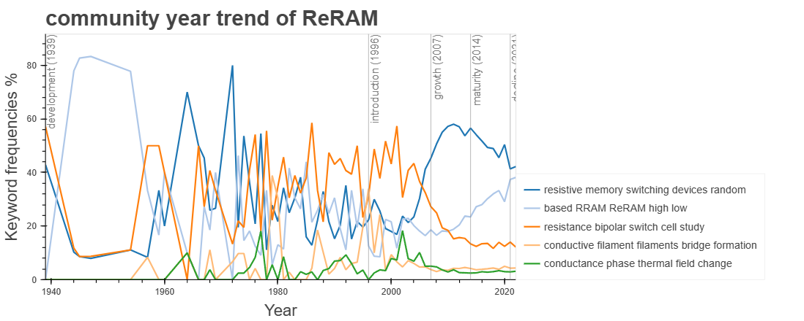

<p align="center"></p>

# 키워드 기반 자동 연구 구조화 (KARS)
서지 메타데이터를 기반으로 과학 문헌에서 키워드를 자동 추출하고, 연구 분야를 구조화하며, 연구 동향을 분석하는 도구입니다. 연구의 공간적 구조와 시간적 흐름을 제시합니다.

## 목차
- [특징](#특징)
- [설치](#설치)
- [빠른 시작](#빠른-시작)
- [예제 데이터셋: ReRAM Present and Future](#예제-데이터셋-reram-present-and-future)
- [결과물](#결과물)
- [인용](#인용)
- [기여자](#기여자)

## 특징
- 서지 데이터에서 키워드 자동 추출
- 모듈화된 키워드 네트워크 구축(PageRank로 중요도, Louvain 모듈러리티로 커뮤니티)
- 연도/커뮤니티별 시간적 추세 분석
- 대화형 HTML 시각화 및 Gephi 내보내기

## 설치
1. 저장소 클론
```bash
git clone https://github.com/khyeon-cnmd/KARS.git
cd KARS
```

2. Conda 환경 생성/활성화(Python 3.10)
```bash
conda create -n KARS python==3.10
conda activate KARS
```

3. Python 의존성 설치
```bash
pip install jsonlines gradio==3.47.0 "networkx[default]" tqdm pandas scipy bokeh spacy
```

4. spaCy 모델 다운로드
```bash
python -m spacy download en_core_web_sm
python -m spacy download en_core_web_trf
```

## 빠른 시작
GUI 실행:
```bash
python KARS_GUI.py
```
### 1. DB 구성
<p align="center"></p>

- 선호하는 검색 엔진(예: Web of Science, Crossref)으로 서지 메타데이터를 수집합니다.
- 아래와 같은 폴더 구조를 만듭니다(이미지 참고).
```
DB_name
└── 1
    └── KBSE.json
└── 2
    └── KBSE.json
└── ...
```
- 각 메타데이터를 `KBSE.json`과 동일한 JSON 형식으로 변환합니다(`example_metadata.json` 참고).
- 'ReRAM_DB.tar'에 포함된 예시 DB 구조를 참고하세요.

### 2. load_DB
<p align="center"></p>

- 서지 메타데이터가 들어 있는 데이터베이스 디렉터리 경로를 입력하고 Submit을 클릭하세요.

### 3. keyword_extraction
<p align="center"></p>

- UPoS 모델:
  - `en_core_web_sm` — 빠르고 가벼움
  - `en_core_web_trf` — 더 정확하지만 느림
- 텍스트 소스:
  - `title` — 논문 제목에서 키워드 추출
  - `abstract` — 논문 초록에서 키워드 추출

### 4. network_construction
<p align="center"></p>

- Submit을 클릭하면 논문 간 키워드 동시출현 네트워크를 구축합니다.

### 5. research_trend_analysis
<p align="center"></p>

- 키워드 빈도 컷오프(%) — 드문 키워드를 필터링합니다.
  - 높음 → 키워드 수 적고 크기 큼; 관련 용어 누락 가능
  - 낮음 → 키워드 수 많고 크기 작음; 희귀 용어 포함
- 커뮤니티 최소 빈도 가중치 — 성숙도가 낮은 커뮤니티를 제외합니다.
  - 높음 → 커뮤니티 수 감소
  - 낮음 → 커뮤니티 수 증가
- 연도 범위 — 분석할 최소/최대 연도를 지정합니다.
- PLC 성숙도 범위 — 시작/종료 단계를 선택합니다:
  - `Development(개발)`, `Introduction(도입)`, `Growth(성장)`, `Maturity(성숙)`, `Decline(쇠퇴)`

## 결과물
1. KARS.gexf, KARS_community.gexf
   - PageRank 기반 키워드 중요도(노드 크기)와 Louvain 모듈러리티 기반 커뮤니티(노드 색상). Gephi에서 열람 가능.
   <p align="center"></p>

2. research_maturity.html  
   - 제품수명주기(PLC) 모델에 따라 전체 커뮤니티의 연도별 키워드 수로 연구 성숙도를 평가합니다.  
   <p align="center"></p>

3. community_year_trend.html  
   - 연도별 커뮤니티의 키워드 분포 변화를 보여줍니다. 추세 분석에 유용합니다.  
   <p align="center"></p>

4. keyword_evolution.html  
   - 커뮤니티 성숙 단계별 상위 키워드의 시간적 비중 변화를 나타냅니다.  
   <p align="center"></p>

## 예제 데이터셋: ReRAM Present and Future
제공된 ReRAM_DB.tar에는 논문에서 사용한 서지 메타데이터와 구조화된 연구 데이터가 포함되어 있습니다(“A keyword-based approach to analyzing scientific research trends: ReRAM present and future”).

데이터 구성:
- ReRAM_DB/KARS/metadata_source.csv — 원본 메타데이터
- ReRAM_DB/KARS/network_article.gephi — 원본 키워드 네트워크
- ReRAM_DB/database — 본 코드에 맞게 변환된 메타데이터

참고: PageRank와 모듈러리티 결과는 Gephi에서 계산된 값과 다를 수 있습니다.

예제 데이터로 테스트하는 방법:
```bash
tar -xf ReRAM_DB.tar
python KARS_GUI.py
# GUI에서 "load_DB"에 압축 해제한 ReRAM_DB 디렉터리를 지정한 후,
# keyword_extraction → network_construction → research_trend_analysis 순서로 실행하세요.
```

## 인용
Kim, H., Kim, S.H., Kim, J. et al. A keyword-based approach to analyzing scientific research trends: ReRAM present and future. Sci Rep 15, 12011 (2025). https://doi.org/10.1038/s41598-025-93423-5

## 기여자
- 개념화(Conceptualization): Hyeon Kim, Donghwa Lee  
- 데이터 큐레이션(Data Curation): Hyeon Kim  
- 형식 분석(Formal Analysis): Hyeon Kim, Donghwa Lee  
- 연구비 수주(Funding Acquisition): Donghwa Lee  
- 조사/실험(Investigation): Hyeon Kim, Eun Ho Kim, Jun Hyeong Gu, Donghwa Lee  
- 방법론(Methodology): Hyeon Kim, Seong Hun Kim, Jaeseon Kim, Donghwa Lee  
- 프로젝트 관리(Project Administration): Hyeon Kim, Donghwa Lee  
- 자원(Resources): Donghwa Lee  
- 소프트웨어(Software): Donghwa Lee  
- 지도(Supervision): Donghwa Lee  
- 검증(Validation): Hyeon Kim